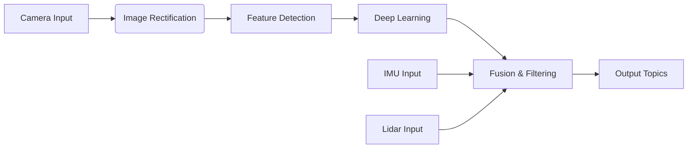

# Chapter 3.2: Isaac ROS Perception

## Introduction

Isaac ROS is a collection of hardware-accelerated perception and navigation packages that bridge the gap between NVIDIA's GPU computing platform and the Robot Operating System (ROS). These packages leverage NVIDIA's CUDA cores, Tensor Cores, and RT Cores to provide significant performance improvements over traditional CPU-based approaches for robotics perception tasks. This chapter explores the key Isaac ROS perception packages and how to integrate them into your robotic applications.

## Learning Objectives

By the end of this chapter, you should be able to:
1. Understand the architecture and capabilities of Isaac ROS perception packages
2. Implement hardware-accelerated VSLAM systems using Isaac ROS
3. Configure perception pipelines for different robotic applications
4. Optimize perception performance using NVIDIA hardware acceleration
5. Integrate Isaac ROS perception with other ROS 2 components

## What is Isaac ROS?

Isaac ROS is NVIDIA's collection of hardware-accelerated packages designed to run on Jetson platforms and NVIDIA GPUs. It provides:

- **Hardware Acceleration**: Leverages CUDA, TensorRT, and RTX technologies
- **ROS 2 Compatibility**: Native support for ROS 2 interfaces and conventions
- **Production Ready**: Designed for deployment in real-world robotic applications
- **Comprehensive Suite**: Covers perception, navigation, manipulation, and simulation

### Key Perception Packages

The Isaac ROS perception suite includes several key packages:

1. **Isaac ROS AprilTag**: High-precision fiducial marker detection
2. **Isaac ROS AprilTag Pose Estimator**: 6DOF pose estimation from AprilTag detections
3. **Isaac ROS CenterPose**: 6DOF object pose estimation using deep learning
4. **Isaac ROS DNN Inference**: General-purpose deep neural network inference
5. **Isaac ROS Stereo DNN**: Stereo vision with deep learning processing
6. **Isaac ROS Visual Slam**: Visual-inertial SLAM with GPU acceleration
7. **Isaac ROS ISAAC ROS OAK**: Integration with Luxonis OAK devices
8. **Isaac ROS Point Cloud**: GPU-accelerated point cloud processing

## Isaac ROS Architecture

### Component Structure

Isaac ROS follows the ROS 2 component model, with each package providing:

- **Nodes**: Standalone executables or composable components
- **Interfaces**: Standard ROS 2 message and service definitions
- **Parameters**: Runtime configuration options
- **Lifecycle Management**: Proper node startup and shutdown procedures

### Hardware Acceleration Layers

Isaac ROS leverages multiple layers of hardware acceleration:

1. **CUDA Cores**: Parallel processing for general compute tasks
2. **Tensor Cores**: AI and deep learning acceleration
3. **RT Cores**: Ray tracing for synthetic data generation
4. **Video Encoding/Decoding**: Hardware-accelerated media processing

## Isaac ROS AprilTag Package

The AprilTag package provides high-precision fiducial marker detection:

### Installation and Setup

```bash
# Install Isaac ROS AprilTag package
sudo apt install ros-humble-isaac-ros-apriltag
```

### Basic Usage

```python
import rclpy
from rclpy.node import Node
from vision_msgs.msg import AprilTagDetectionArray
from sensor_msgs.msg import Image

class AprilTagNode(Node):
    def __init__(self):
        super().__init__('apriltag_node')

        # Create subscription for camera images
        self.subscription = self.create_subscription(
            Image,
            '/camera/image_raw',
            self.image_callback,
            10
        )

        # Create publisher for AprilTag detections
        self.publisher = self.create_publisher(
            AprilTagDetectionArray,
            '/apriltag/detections',
            10
        )

    def image_callback(self, msg):
        # AprilTag processing would happen here
        # The Isaac ROS AprilTag node handles the actual detection
        pass

def main(args=None):
    rclpy.init(args=args)
    apriltag_node = AprilTagNode()
    rclpy.spin(apriltag_node)
    apriltag_node.destroy_node()
    rclpy.shutdown()

if __name__ == '__main__':
    main()
```

### Launch File Configuration

```xml
<launch>
  <!-- AprilTag detector node -->
  <node pkg="isaac_ros_apriltag" exec="isaac_ros_apriltag" name="apriltag">
    <param name="size" value="0.166"/>
    <param name="max_tags" value="64"/>
    <param name="tag_family" value="tag36h11"/>
    <remap from="image" to="/camera/image_rect_color"/>
    <remap from="camera_info" to="/camera/camera_info"/>
    <remap from="detections" to="/apriltag/detections"/>
  </node>
</launch>
```

## Isaac ROS Visual SLAM

Visual SLAM (Simultaneous Localization and Mapping) is critical for robot autonomy:

### Components of Visual SLAM

1. **Feature Detection**: Identifying distinctive points in images
2. **Feature Tracking**: Following features across image sequences
3. **Pose Estimation**: Computing camera/robot pose from features
4. **Mapping**: Building a map of the environment
5. **Loop Closure**: Recognizing previously visited locations

### Isaac ROS Visual Slam Package

The Isaac ROS Visual Slam package provides GPU-accelerated VSLAM:

```bash
# Install Isaac ROS Visual Slam
sudo apt install ros-humble-isaac-ros-visual-slam
```

### Configuration

```yaml
# config/visual_slam_params.yaml
visual_slam_node:
  ros__parameters:
    # Input parameters
    enable_debug_mode: false
    enable_distortion_correction: true
    rectified_images: true

    # Tracking parameters
    min_num_points_tracking: 100
    max_num_points_tracking: 1000
    tracking_rate_hz: 10.0

    # Mapping parameters
    min_num_points_mapping: 50
    max_num_points_mapping: 500
    mapping_rate_hz: 5.0

    # Loop closure parameters
    enable_loop_closure: true
    min_loop_closure_interval: 5.0
    min_loop_closure_translation: 1.0
```

### Launch File

```xml
<launch>
  <!-- Isaac ROS Visual Slam -->
  <node pkg="isaac_ros_visual_slam" exec="isaac_ros_visual_slam" name="visual_slam">
    <param from="config/visual_slam_params.yaml"/>
    <remap from="stereo_camera/left/image" to="/camera/left/image_rect_color"/>
    <remap from="stereo_camera/right/image" to="/camera/right/image_rect_color"/>
    <remap from="stereo_camera/left/camera_info" to="/camera/left/camera_info"/>
    <remap from="stereo_camera/right/camera_info" to="/camera/right/camera_info"/>
    <remap from="visual_slam/imu" to="/imu/data"/>
    <remap from="visual_slam/pose_graph/visual_slam_path" to="/path"/>
    <remap from="visual_slam/visual_slam_graph" to="/graph"/>
  </node>
</launch>
```

## Isaac ROS Deep Learning Inference

### Isaac ROS DNN Inference Package

The DNN Inference package provides hardware-accelerated neural network execution:

```python
import rclpy
from rclpy.node import Node
from sensor_msgs.msg import Image
from isaac_ros_tensor_rt.tensor_rt_inference import TensorRTInference

class DNNInferenceNode(Node):
    def __init__(self):
        super().__init__('dnn_inference_node')

        # Initialize TensorRT inference engine
        self.inference_engine = TensorRTInference(
            engine_file_path='/path/to/model.plan',
            input_binding_name='input',
            output_binding_name='output'
        )

        # Create subscription and publisher
        self.subscription = self.create_subscription(
            Image,
            '/camera/image_raw',
            self.inference_callback,
            10
        )

        self.publisher = self.create_publisher(
            # Output message type depends on your model
            # e.g., vision_msgs.msg.Detection2DArray for object detection
        )

    def inference_callback(self, msg):
        # Perform inference on the received image
        result = self.inference_engine.infer(msg)

        # Publish the result
        self.publisher.publish(result)

def main(args=None):
    rclpy.init(args=args)
    node = DNNInferenceNode()
    rclpy.spin(node)
    node.destroy_node()
    rclpy.shutdown()
```

### Model Preparation

To use custom models with Isaac ROS:

1. **Train your model** using frameworks like PyTorch or TensorFlow
2. **Convert to ONNX format** for cross-platform compatibility
3. **Optimize with TensorRT** for hardware acceleration
4. **Deploy to robot** with appropriate inference parameters

## Isaac ROS Stereo Processing

Stereo vision provides depth information without active sensing:

### Stereo DNN Package

The Stereo DNN package combines stereo vision with deep learning:

```yaml
# config/stereo_dnn_params.yaml
stereo_dnn_node:
  ros__parameters:
    # Model parameters
    model_path: '/path/to/stereo_model.plan'
    input_width: 960
    input_height: 544

    # Processing parameters
    confidence_threshold: 0.5
    max_disparity: 128

    # Hardware acceleration
    gpu_device_id: 0
    input_tensor_layout: 'NHWC'
```

### Stereo Processing Pipeline

1. **Rectification**: Correct lens distortion and align stereo images
2. **Feature Matching**: Find corresponding points in left and right images
3. **Disparity Computation**: Calculate disparity map from matched features
4. **Depth Conversion**: Convert disparity to depth information
5. **Deep Learning Enhancement**: Use neural networks for improved accuracy

## Performance Optimization

### GPU Utilization

To maximize GPU performance:

1. **Batch Processing**: Process multiple inputs together when possible
2. **Memory Management**: Use pinned memory for faster transfers
3. **Stream Processing**: Use CUDA streams for overlapping operations
4. **Precision Optimization**: Use FP16 or INT8 when accuracy permits

### Example Optimization Code

```python
import cupy as cp
import numpy as np

class OptimizedPerceptionNode(Node):
    def __init__(self):
        super().__init__('optimized_perception_node')

        # Allocate GPU memory in advance
        self.gpu_buffer = cp.empty((480, 640, 3), dtype=np.uint8)

        # Create CUDA stream for asynchronous processing
        self.stream = cp.cuda.Stream()

        # Set up pinned memory for faster CPU-GPU transfer
        self.pinned_buffer = cp.cuda.PinnedMemoryPointer(cp.cuda.MemoryPointer(
            cp.cuda.alloc_pinned_memory(480 * 640 * 3 * 4)
        ), 0)

    def optimized_processing(self, cpu_image):
        with self.stream:
            # Asynchronously copy from CPU to GPU
            self.gpu_buffer.set(cpu_image)

            # Perform GPU computation
            result = self.gpu_processing_kernel(self.gpu_buffer)

            # Synchronize stream
            self.stream.synchronize()

        return result.get()  # Copy result back to CPU
```

### Memory Management Best Practices

1. **Pool Allocation**: Reuse memory buffers to avoid allocation overhead
2. **Zero-Copy**: Use unified memory when possible to reduce copies
3. **Async Transfers**: Overlap CPU and GPU operations
4. **Memory Monitoring**: Track memory usage to prevent leaks

## Isaac ROS Perception Pipeline Design

### Modular Architecture

Design perception pipelines as modular components:



### Configuration Management

Use parameter files to configure pipeline components:

```yaml
# perception_pipeline_config.yaml
camera_processing:
  enable_rectification: true
  rectification_alpha: 0.0
  output_resolution: [640, 480]

feature_detection:
  max_features: 1000
  min_feature_distance: 10
  quality_level: 0.01

deep_learning:
  confidence_threshold: 0.7
  nms_threshold: 0.4
  max_objects: 100

fusion_filtering:
  enable_kalman_filtering: true
  process_noise: 0.1
  measurement_noise: 0.05
```

## Integration with Navigation Systems

### Perception-Navigation Interface

Connect perception outputs to navigation systems:

```python
class PerceptionNavigatorInterface(Node):
    def __init__(self):
        super().__init__('perception_navigator_interface')

        # Subscribe to perception outputs
        self.detection_sub = self.create_subscription(
            Detection2DArray,
            '/perception/detections',
            self.detection_callback,
            10
        )

        # Subscribe to point cloud data
        self.pointcloud_sub = self.create_subscription(
            PointCloud2,
            '/perception/pointcloud',
            self.pointcloud_callback,
            10
        )

        # Publish to navigation system
        self.obstacle_pub = self.create_publisher(
            OccupancyGrid,
            '/navigation/local_costmap/costmap',
            10
        )

    def detection_callback(self, msg):
        # Convert detections to navigation-compatible format
        occupancy_grid = self.detections_to_costmap(msg.detections)
        self.obstacle_pub.publish(occupancy_grid)

    def pointcloud_callback(self, msg):
        # Process point cloud for obstacle detection
        obstacles = self.pointcloud_to_obstacles(msg)
        occupancy_grid = self.obstacles_to_costmap(obstacles)
        self.obstacle_pub.publish(occupancy_grid)
```

### Sensor Fusion

Combine multiple perception sources:

```python
class SensorFusionNode(Node):
    def __init__(self):
        super().__init__('sensor_fusion_node')

        # Multiple sensor inputs
        self.camera_sub = self.create_subscription(
            Detection2DArray, '/camera/detections', self.camera_cb, 10
        )

        self.lidar_sub = self.create_subscription(
            PointCloud2, '/lidar/points', self.lidar_cb, 10
        )

        self.radar_sub = self.create_subscription(
            RadarTrackArray, '/radar/tracks', self.radar_cb, 10
        )

        # Fused output
        self.fused_pub = self.create_publisher(
            ObjectHypothesisArray, '/fused/perceptions', 10
        )

    def fuse_sensors(self):
        # Implement sensor fusion algorithm
        # Typically uses Kalman filters, particle filters, or neural networks
        pass
```

## Troubleshooting and Debugging

### Common Issues

1. **GPU Memory Exhaustion**: Monitor memory usage and optimize batch sizes
2. **CUDA Driver Issues**: Ensure proper driver and runtime versions
3. **Performance Bottlenecks**: Profile code to identify slow operations
4. **Synchronization Problems**: Use proper threading and message filters

### Debugging Tools

```bash
# Monitor GPU usage
nvidia-smi

# Profile CUDA applications
nsys profile --trace=cuda,nvtx ros2 run your_package your_node

# Monitor ROS 2 topics
ros2 topic hz /perception/output
ros2 topic bw /perception/output
```

### Performance Monitoring

```python
class PerformanceMonitor(Node):
    def __init__(self):
        super().__init__('performance_monitor')

        # Timer for periodic monitoring
        self.timer = self.create_timer(1.0, self.monitor_performance)

        # Performance metrics
        self.processing_times = []
        self.memory_usage = []

    def monitor_performance(self):
        # Log performance metrics
        avg_time = sum(self.processing_times) / len(self.processing_times) if self.processing_times else 0
        self.get_logger().info(f'Average processing time: {avg_time:.3f}s')

        # Reset for next interval
        self.processing_times = []
```

## Exercises

1. **AprilTag Detection Setup**: Configure and run the Isaac ROS AprilTag package with a camera stream. Measure the detection rate and accuracy compared to a CPU-based implementation.

2. **VSLAM Implementation**: Set up the Isaac ROS Visual SLAM package with a stereo camera or RGB-D sensor. Evaluate the mapping accuracy and computational performance on different hardware configurations.

3. **Custom DNN Pipeline**: Integrate a custom trained neural network with Isaac ROS DNN Inference. Optimize the model for your specific hardware and evaluate the performance gains from hardware acceleration.

## References

1. NVIDIA. (2023). "Isaac ROS Documentation". https://docs.nvidia.com/isaac/isaac_ros_documentation/index.html
2. NVIDIA. (2023). "Isaac ROS Perception Packages". https://github.com/NVIDIA-ISAAC-ROS
3. Murillo, A. C., et al. (2021). "Hardware-accelerated perception for robotics using Isaac ROS". IEEE Robotics & Automation Magazine.

## Summary

Isaac ROS provides powerful hardware-accelerated perception capabilities that significantly enhance robotic systems' ability to understand their environment. By leveraging NVIDIA's GPU computing platform, Isaac ROS enables real-time processing of complex perception tasks that would be computationally prohibitive on CPUs alone. The modular architecture and ROS 2 compatibility make it straightforward to integrate these advanced perception capabilities into existing robotic systems, enabling new possibilities for autonomous robots that require sophisticated environmental understanding.